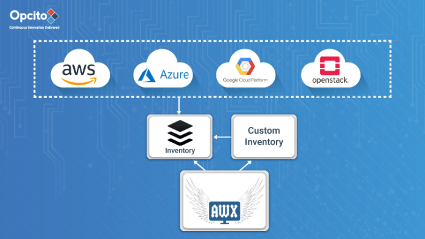
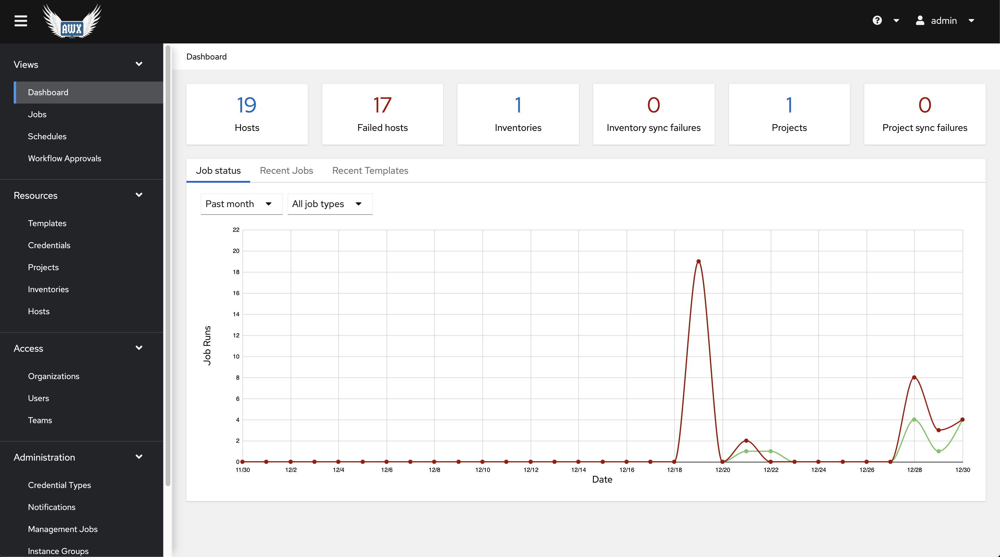

# OSS Ansible Tower

This role deploys Ansible AWX. It is deployed into docker containers

#### Dependencies

- Ubuntu 18.04+
- Docker

#### VM testing

- 5gb RAM
- 2 cores



#### Access
[http://localhost:80](http://localhost:80)

```shell script
ejaw425@ubuntu:~/ejaw425/marriott/lab/git.marriott.com/ansible-awx$ sudo docker ps 

CONTAINER ID        IMAGE                COMMAND                  CREATED             STATUS              PORTS                  NAMES
2ed36d461361        ansible/awx:15.0.1   "/usr/bin/tini -- /u…"   3 hours ago         Up 3 hours          8052/tcp               awx_task
72133fbb2d8c        ansible/awx:15.0.1   "/usr/bin/tini -- /b…"   3 hours ago         Up 3 hours          0.0.0.0:80->8052/tcp   awx_web
105dc90fb059        postgres:10          "docker-entrypoint.s…"   3 hours ago         Up 3 hours          5432/tcp               awx_postgres
5d25bccc2461        redis                "docker-entrypoint.s…"   3 hours ago         Up 3 hours          6379/tcp               awx_redis
```

#### Log 
```shell script
TASK [local_docker : Create Docker Compose Configuration] **********************************************************************************************
ok: [localhost] => (item={'file': 'environment.sh', 'mode': '0600'})
changed: [localhost] => (item={'file': 'credentials.py', 'mode': '0600'})
ok: [localhost] => (item={'file': 'docker-compose.yml', 'mode': '0600'})
ok: [localhost] => (item={'file': 'nginx.conf', 'mode': '0600'})
ok: [localhost] => (item={'file': 'redis.conf', 'mode': '0664'})

TASK [local_docker : Render SECRET_KEY file] ***********************************************************************************************************
ok: [localhost]

TASK [local_docker : Start the containers] *************************************************************************************************************
changed: [localhost]

TASK [local_docker : Update CA trust in awx_web container] *********************************************************************************************
changed: [localhost]

TASK [local_docker : Update CA trust in awx_task container] ********************************************************************************************
changed: [localhost]

PLAY RECAP *********************************************************************************************************************************************
localhost                  : ok=15   changed=4    unreachable=0    failed=0    skipped=91   rescued=0    ignored=0   

ejaw425@ubuntu:~/ejaw425/marriott/lab/github/awx/installer$ sudo docker ps 
CONTAINER ID        IMAGE                COMMAND                  CREATED             STATUS              PORTS                  NAMES
2ed36d461361        ansible/awx:15.0.1   "/usr/bin/tini -- /u…"   2 minutes ago       Up 2 minutes        8052/tcp               awx_task
72133fbb2d8c        ansible/awx:15.0.1   "/usr/bin/tini -- /b…"   2 minutes ago       Up 2 minutes        0.0.0.0:80->8052/tcp   awx_web
105dc90fb059        postgres:10          "docker-entrypoint.s…"   2 minutes ago       Up 2 minutes        5432/tcp               awx_postgres
5d25bccc2461        redis                "docker-entrypoint.s
```